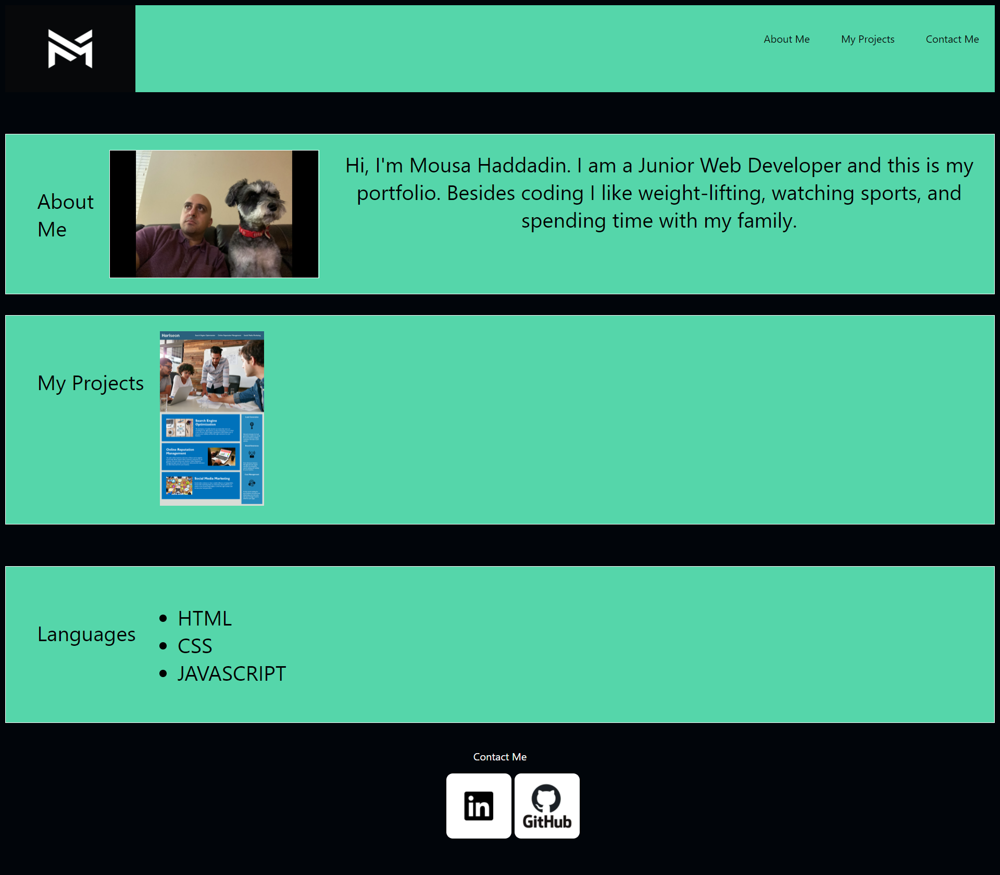

# portfolio

# 02 Advanced CSS: Portfolio

## Description

My Portfolio website has my name, a photo, and has links at the footer on how to reach me through LinkedIn or view my Github. When you click on my Project image it takes you to the webpage.

## Screenshot of portfolio

## Links to Application

- Here is the repo : [mhaddadin1/repo](https://github.com/mhaddadin1/portfolio)
- Here is the pages: [mhaddadin1/pages](https://mhaddadin1.github.io/portfolio/)
